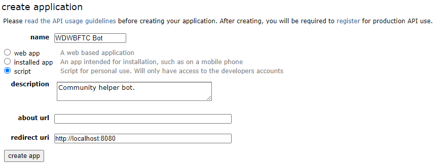
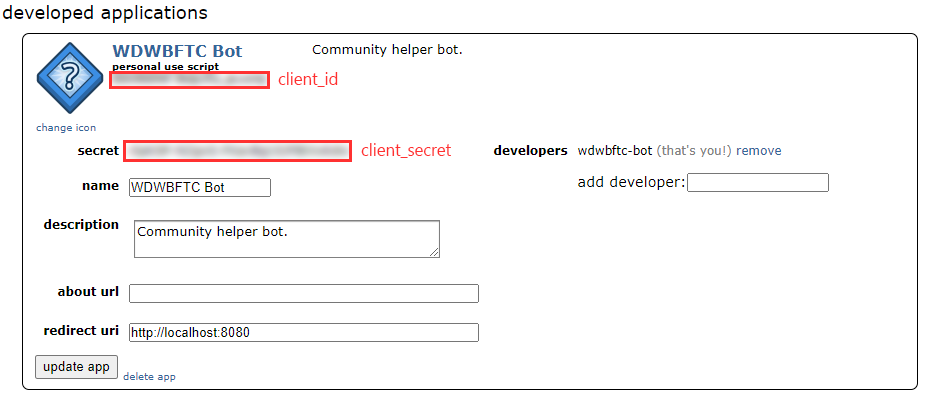

# WDWBFTC Reddit Bot

## Description

Reddit bot to submit comment on posts where the author has posted comments in certain subreddits in the past. 

### Disclaimer

The author of this application may not be held liable for Reddit application or user ban resulting from using this application.

Please use it responsibly and within reason. 

## Pre-requisites

* Python 3.9 or newer.
* Install required libraries with: `pip install -r requirements.txt`

## Set-up

1. Create Reddit user account.
2. Create Reddit application based on the [Creating Reddit application](#creating-reddit-application) section below.
3. Start the application with `py main.py`. 
   * `config.sample.json` will be copied to `config.json` and the application will exit.
4. Fill `config.json` based on the [Configuration](#configuration) section below.

### Creating Reddit application

1. Create application: 
   * https://www.reddit.com/prefs/apps
   * Create app:
     * Type: script
     * Description: Community helper bot.
     * About URL:
     * Redirect URI: http://localhost:8080
     * Create app

2. Register for API:
   * https://docs.google.com/forms/d/e/1FAIpQLSezNdDNK1-P8mspSbmtC2r86Ee9ZRbC66u929cG2GX0T9UMyw/viewform
   * Company Name: n/a
   * Company Point of Contact (Name & Title): <provide name> (individual)
   * POC Email: <provide email address>
   * Reddit API Use Case: Community helper bot. Post information on threads by new users.
   * Developer Platform: Python
   * OAUTH Client ID(s): <provide client ID from step 1>
   * Send

### Configuration

* `config.json`
  * `authentication`
    * `client_id`: Reddit application client ID. If not provided, will be asked from user input.
    * `client_secret`: Reddit application client secret. If not provided, will be asked from user input.
    * `username`: Reddit user account username to post comments with. If not provided, will be asked from user input.
    * `password`: Reddit user password to post comments with. If not provided, will be asked from user input.
    * `user_agent`: Provide it in the following format: `<platform>:<app ID>:<version string> (by /u/<reddit username>)`.
      * E.g.: `python:bot.reddit.my_friendly_bot:1.0 (by /u/my_registered_username)` (Must be unique to each application. Do not use this as is!)
  * `settings`
    * `test_run`: If `true`, comments will not be posted. 
    * `loop_minutes`: Perform main processing loop every `x` minutes. If `0`, processing will be done only once.
  * `conditions`: List of conditions.
    * `subreddits`: Subreddits to check submissions for.
    * `check_subreddits`: Subreddits to check author's posts for.
    * `message`: Message to post on submission if author has posts in any of the `check_subreddits`.
    * `check_message`: Messages to check for on the submission. If found, message will not be posted.
    * `expiration_days`: Posts by author will be not considered if posted more than `x` days ago.
    * `new_posts_minutes`: Submissions in subreddit will not be processed if posted more than `x` minutes ago.

## Usage

* Run with `py main.py` after performing [Pre-requisites](#pre-requisites), [Set-up](#set-up) sections above. 
* If `loop` configuration is set to value other than `0`, exit with keyboard interrupt (e.g. Ctrl + C). 

## Notes

* Newly registered application might need a certain amount of time before it is granted access to the API.
* Newly registered Reddit user might need a certain amount of time and/or karma before its comments become visible for other users, based on the subreddit's rules.

## Additional documentation

* Reddit API access documentation: https://www.reddit.com/wiki/api
* Reddit API documentation: https://github.com/reddit-archive/reddit/wiki/API
* PRAW: https://praw.readthedocs.io/en/stable/getting_started/quick_start.html